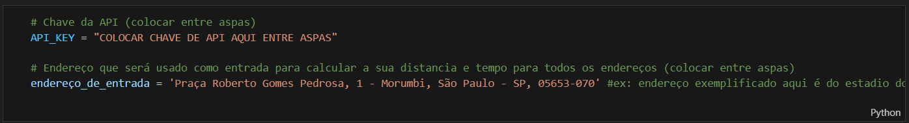
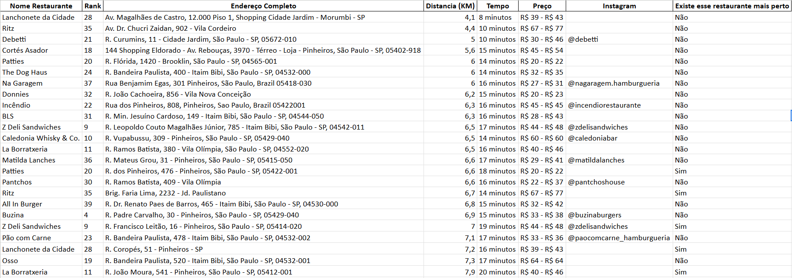

# 📍 Top 42 Hamburguerias de São Paulo

Este repositório contém um código que, a partir do seu endereço, calcula e ordena as 42 melhores hamburguerias de São Paulo com base na distância até você.

Além da proximidade, você terá acesso a diversas informações úteis:

- 🏆 Posição no ranking
- 📍 Endereço
- 📸 Instagram oficial
- 💰 Faixa de preço
- 🔁 Indicação se há uma unidade da mesma rede ainda mais perto de você

🍔 O ranking foi elaborado a partir das recomendações dos perfis O Crítico Antigourmet, Taster BR e Gastronomium.

# Como utilizar?

Basta clonar este repositório, abrir o notebook hamburguer.ipynb e executar um Run All. Antes disso, é necessário ter uma chave da Google Distance Matrix API: substitua o valor da variável 'API_KEY' pela sua chave e, no campo 'endereço_de_entrada', insira o endereço que servirá como ponto de referência para calcular a distância até todas as hamburguerias.

# 🚀 Como gerar sua chave da Google Distance Matrix API:

1. Acesse o Google Cloud Console
2. Crie um novo projeto ou selecione um já existente.
3. No menu lateral, vá em APIs e Serviços > Biblioteca.
4. Pesquise por Distance Matrix API e clique em Ativar.
5. Ainda em APIs e Serviços, vá em Credenciais.
6. Clique em Criar credenciais > Chave de API.
7. Copie a chave gerada e guarde em local seguro.
8. Use essa chave no seu projeto, substituindo 'API_KEY'.

# Resultado
Ao rodar o notebook, o código gera um arquivo Excel contendo todas as 42 melhores hamburguerias de São Paulo, com informações completas e ordenadas de acordo com a distância em relação ao endereço informado. Todas as informações estão tabeladas, facilitando a visualização e ajudando você a decidir qual hamburgueria visitar.

Caso não queira rodar nenhum código, também é possível acessar o arquivo tabela_infos_restaurante.xlsx
, que contém endereço, preço, Instagram e ranking de cada restaurante. Esse arquivo não inclui distância, tempo de deslocamento, nem indica se há outra unidade da mesma rede mais próxima, e os dados também não estão ordenados.
